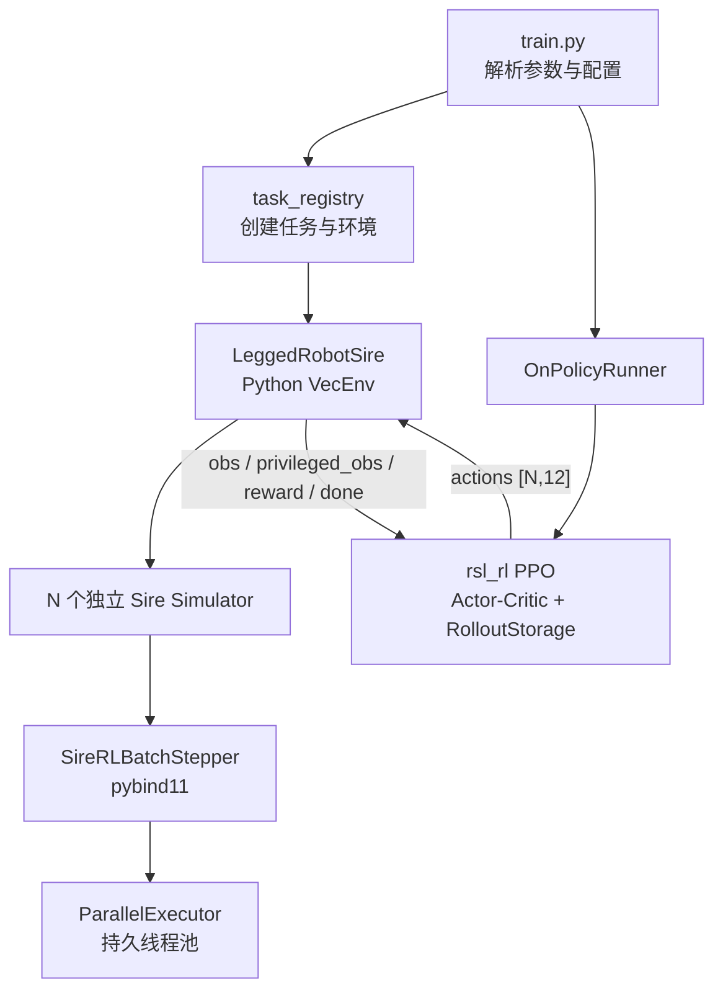
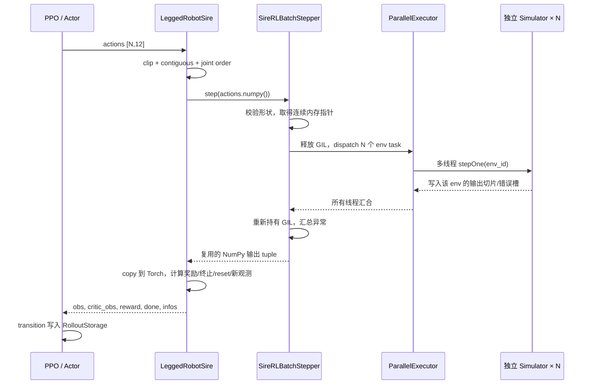

# Sire 强化学习技术路线：从 PPO 到持久化多线程批处理

> 本文以当前 `dev` 分支的 `go2` 任务为准，目的是解释代码为什么这样设计、一次训练迭代究竟发生了什么，以及面试中如何证明实现的正确性与边界。它不是安装手册。

## 2026-09-08 上游集成说明

当前已接入 `leitianjian/sire` 的 `dev@6837212`。集成前的本地实现和实验入口保存在
`0b87a04`；下文尚未逐节更新的故障恢复、记录器接口及旧求解路径说明应按该历史版本理解。

- 求解器、原生 RL adapter、关节安全及训练配置采用上游版本；Go2 默认使用
  `ShiftedSpectralAdmmContactSolver`、`shifted_ncp` 关节限位和 `0.001 s` 步长。
- 本地 TensorBoard/`metrics.jsonl`、损失诊断、实验观测器以及 MuJoCo 坐标系修复保留。
  记录开关已统一为 `setSireHistoryRecording()`，故障计数读取原生 `totalRecoveredFailures`。
- 新构建入口为 `.venv/bin/python python/build_native.py --jobs 8`；本机依赖前缀保存在
  不跟踪的 `python/local.toml`。Linux runtime 随包带上所选 ARIS 和 Clarabel，并配置相对加载路径。
- 1024 环境 / 16 线程短测：`0.001 s` 两轮 value loss 为 `0.1201 / 0.08765`，故障恢复为 0；
  `0.005 s` 两轮累计恢复 17 次，value loss 为 `3.53e10 / 2.06e5`。
  **当前上游组合的 5 ms 训练不稳定；保留该 CLI 入口不代表数值验证通过。**
- Python/构建工具测试通过；原生矩阵运算 16 项通过，接触测试 27 项中 14 项通过、13 项失败。
  失败集中于上游接触结束时间精度断言：实现采用至多 `1e-8 s` 的时间容差，部分测试要求
  `1e-12` 至 `1e-15 s`。这部分源码和测试均保持上游原样，尚未修正；不能据此认定与 5 ms 发散同因。

历史实验数据与策略文件未改动。复现实验请匹配集成前版本；新版本结果另存日期目录，勿混入旧数据。

## 1. 一句话概括项目

这套 RL 管线把 Sire 作为 CPU 物理后端，通过 pybind11 将一批独立的 `Simulator` 交给 C++，使用一个与环境同生命周期的持久线程池并行推进；Python 侧负责观测、奖励、终止和 PPO，C++ 侧复用 Sire 原有的事件驱动积分、碰撞、连续接触与约束求解，不重新实现物理算法。

核心价值有三点：

1. 将逐环境 Python/C++ 调用合并为一次批量调用，降低解释器和绑定层开销。
2. 释放 GIL 后，用多个原生线程同时推进互不共享状态的 Sire 环境。
3. 保持原 Sire 求解路径不变，因此并行层和物理算法可以分别验证。

## 2. 当前基线参数

以下参数来自当前默认 `go2` 配置，而不是历史实验配置。

| 项目 | 当前值 | 含义 |
| --- | ---: | --- |
| 默认环境数 | 320 | 可用 `--num_envs` 覆盖；压力测试常用 1024 |
| 动作维度 | 12 | GO2 的 12 个驱动关节 |
| Actor 观测维度 | 45 | 仅策略部署所需的本体观测 |
| Critic 观测维度 | 235 | 非对称 Actor-Critic 的特权观测兼容维度 |
| 物理基准步长 | 0.001 s | 1 kHz，写入每个 Sire `SimulationLoop.deltaT` |
| 控制周期 | 0.020 s | `decimation=20`，策略频率 50 Hz |
| 单回合时长 | 20 s | 最多 1000 个控制步 |
| 每次 PPO rollout | 120 步/环境 | 每环境覆盖 2.4 s 仿真时间 |
| 1024 环境每轮样本数 | 122,880 | `1024 × 120` 个 transition |
| 批处理线程数 | 0（自动） | 自动取硬件并发数，并裁剪到不超过环境数 |
| 常用压力测试 | 1024 env / 16 threads | 显式控制 CPU 并行度 |
| 控制方式 | P 控制 | 策略动作是默认关节角附近的偏移量 |
| PPO 网络 | 512-256-128, ELU | Actor 与 Critic 分别建模 |
| PPO 参数 | clip 0.2, γ 0.99, λ 0.95 | 5 epochs，4 mini-batches，adaptive KL |

关键配置文件是 [`go2_config.py`](../demo/demo_python/SireRLGym/envs/go2/go2_config.py) 和 [`legged_robot_config.py`](../demo/demo_python/SireRLGym/envs/base/legged_robot_config.py)。

## 3. 总体架构



模块边界非常明确：

- `train.py`：处理命令行覆盖、随机种子、日志目录、断点续训。
- `task_registry.py`：把任务名映射到环境类、环境配置和训练配置。
- `LeggedRobotSire`：把原始物理状态转成 RL 语义，包括动作、观测、奖励、终止和 reset。
- `SireRLBatchStepper`：一次接收所有环境的动作，在 C++ 中并行推进并批量返回状态。
- `ParallelExecutor`：只负责并发调度，不理解机器人或物理。
- `OnPolicyRunner` 与 `rsl_rl.PPO`：采集 rollout、计算 GAE、执行 PPO 更新、保存日志和模型。

## 4. 从启动命令到第一个动作

典型训练命令：

```bash
PYTHONPATH=python/src:demo/demo_python .venv/bin/python \
  demo/demo_python/SireRLGym/scripts/train.py \
  --task go2 \
  --num_envs 1024 \
  --sire_batch_threads 16 \
  --max_iterations 1000 \
  --save_interval 50 \
  --flat_terrain
```

启动过程如下：

1. `train.py` 通过 `make_env_cfg("go2")` 和 `make_train_cfg("go2")` 实例化配置。
2. 命令行参数覆盖环境数、线程数、训练轮数和地形等字段。
3. `task_registry` 创建 `LeggedRobotSire`，物理后端固定为 CPU/Sire。
4. 环境构造时先解析配置，再创建 Sire 仿真、缓存映射、预分配张量和批处理器。
5. `OnPolicyRunner` 创建 Actor-Critic、PPO 和 `[H,N,...]` 布局的 rollout storage。
6. Runner 调用一次全环境 `reset()`，随后进入采样循环。

默认 Sire 模型实际由 `LeggedRobotSire._create_sire_envs()` 选择：优先使用 [`go2_rai_foot.xml`](../demo/demo_python/sirePaperDogRL/go2_rai_foot.xml)。`cfg.asset.file` 目前不是 Sire 路径的真实模型来源，这一点面试时不要混淆。

## 5. 环境初始化：为什么是 N 个 Simulator

### 5.1 构造顺序

`LeggedRobotSire` 的构造顺序是：

```text
_parse_cfg
  → create_sim / _create_sire_envs
  → _sync_dt_with_model
  → _init_buffers
  → _prepare_reward_function
  → reset_idx(all envs)
  → compute_observations
```

`_create_sire_envs()` 对每个环境都执行：

1. 创建新的 `sire.Simulator`。
2. 从同一份 XML 加载独立的 Model、SimulationLoop 和 PhysicsEngine。
3. 设置 `deltaT=0.001`、`ctrlT=0.020`，然后调用 `sim.init()`。
4. 保存 Python owner 和原生对象引用。
5. 建立 geometry id、part id、foot id、joint id 和 motion id 映射。

代码还额外创建了一个 `base_simulator` 用于读取基础拓扑信息，因此当前实现实际持有 `N+1` 个 Simulator。这是初始化时间和内存仍可优化的地方。

### 5.2 为什么不用一个世界放 N 台机器人

Sire 当前环境采用“一环境一 Simulator”，而不是在同一个物理世界中放 N 台机器人。好处是：

- 环境之间没有模型状态、接触对、事件队列和仿真时钟共享。
- 单环境 reset 不会影响其他环境。
- 并行写状态时天然按环境隔离，线程安全边界清晰。

代价是每个环境都要持有一整套模型、碰撞结构、求解器和记录器，内存开销高于单世界多 actor 方案。

### 5.3 出生点语义

平地任务中所有 Simulator 都使用自己的局部原点，因此每个环境的 RL 状态都从 `(0,0,z)` 出生，不需要在共享世界中做网格平移。

复杂地形会把各环境映射到生成场景中的不同物理 patch。`_physics_origins` 只负责局部坐标和物理场景坐标之间的转换，对策略暴露的仍是每个环境自己的局部坐标。

## 6. 一次策略步的完整调用链



Python 入口 [`LeggedRobotSire.stepSireBatch`](../demo/demo_python/SireRLGym/envs/base/legged_robot_sire.py) 做的事情只有：

1. 裁剪动作并保证 CPU tensor 连续。
2. 使用 `.numpy()` 暴露同一块动作内存。
3. 一次调用 C++ `step()`。
4. 将批量输出复制进长期复用的 Torch buffer。
5. 统一执行 RL 后处理。

它不会再逐环境调用 Python 方法，也不会再次运行旧的 Python 状态刷新循环。旧实现保留为 `legacySireStep()`，只用于精确回归。

## 7. 动作如何变成物理力矩

默认是关节位置型策略。对环境 `e`、关节 `j`：

```text
q_target = q_default + action[e,j] × action_scale
tau      = kp[j] × (q_target - q[j]) - kd[j] × dq[j]
tau      = clamp(tau, -tau_limit[j], tau_limit[j])
```

当前参数为：

- `action_scale = 0.25`
- `kp = 25`
- `kd = 0.6`
- hip/thigh 力矩上限 23.7 Nm，calf 力矩上限 35.55 Nm

这里最容易被追问的点是：**动作在一个 20 ms 控制周期内保持不变，但力矩不是只计算一次。**

Sire 的接触求解是事件驱动的，控制周期内部可能存在多个积分或接触事件。`stepOne()` 在处理每个事件前重新读取最新的 `motion.mp()` 和 `motion.mv()`，再次计算 PD 力矩。这样关节状态在周期内变化后，控制力也随之更新。

虽然接口名是 `ActuatorSISO::setDesiredValue()`，当前 `ActuatorSISO::forward()` 会把该值直接写入 `SingleComponentForce`。因此批处理器传入的是已经算好的力矩，不会再经过第二层 PD。

## 8. 为什么没有重写积分、碰撞和接触求解

`SireRLBatchStepper::stepOne()` 的核心逻辑可以抽象为：

```cpp
while (下一事件不是控制事件) {
    根据最新关节状态更新力矩;
    simulationLoop.handleContact();
}
更新一次力矩;
simulationLoop.handleContact(); // 消费控制边界事件
读取状态;
```

这里调用的是原生 `SimulationLoop::handleContact()`。该函数仍会：

- 从 EventManager 读取下一事件；
- 创建对应 Handler；
- 执行原积分与事件处理；
- 调用原碰撞、接触和约束求解；
- 推进原仿真时钟和事件队列。

所以批处理层只替代“谁来调用 N 个独立仿真”的调度方式，没有实现一套简化积分器，也没有绕过 Sire 的高刚度接触算法。

`deltaT=1 ms` 是基准物理时间尺度，`ctrlT=20 ms` 是策略边界。接触事件可能要求更小或不同的事件步长，因此不能把它简单描述为永远执行恰好 20 次固定积分。

## 9. 持久化多线程批处理的实现

核心代码位于 [`bindings_rl.cpp`](../python/sire/bindings_rl.cpp)，由两个类组成：

- `ParallelExecutor`：通用的持久任务执行器。
- `SireRLBatchStepper`：缓存仿真对象、控制参数、输出数组，并把每个 env 封装成任务。

### 9.1 线程生命周期

假设配置 `T=16`：

1. `ParallelExecutor` 构造时创建 15 个 worker。
2. worker 在条件变量上休眠，不占用忙等待 CPU。
3. 每次 `run()` 唤醒 worker，同时调用 `run()` 的线程也参加计算。
4. 总并行参与者是 16，而不是 16 个 worker 再加一个协调线程。
5. 环境销毁时，析构函数设置 `stopping_`、唤醒并 `join()` 所有 worker。

因此线程只在环境初始化时创建一次，不会在 50 Hz 控制循环中反复创建和销毁。

### 9.2 动态任务领取

每次 dispatch 将 `next_task_` 置零，所有线程执行：

```cpp
env_id = next_task_.fetch_add(1, std::memory_order_relaxed);
if (env_id >= num_envs) return;
stepOne(env_id);
```

使用动态原子索引而不是静态切片，是因为不同环境的接触数量和事件步数不同：

- 没接触的环境可能很快。
- 多足同时接触或发生高刚度事件的环境可能更慢。
- 静态平均分块会让先完成的线程等待最慢分块。
- 动态领取使空闲线程继续处理下一个环境，减轻长尾负载不均。

`memory_order_relaxed` 足够，是因为这个原子变量只需要保证 env id 不重复；任务函数、任务数和 generation 的发布由 mutex + condition variable 建立同步关系。

### 9.3 调用线程为什么也参与

如果 Python 调用线程只做协调，16 线程配置实际上会需要 16 个 worker 加 1 个空闲协调线程，或者只得到 15 个计算线程。让调用线程参与可以：

- 精确兑现用户要求的总线程数；
- 少创建一个长期线程；
- 降低一次 dispatch 的唤醒和调度浪费。

### 9.4 GIL 如何处理

C++ 在完成动作数组校验、取得 `float*` 后进入 `py::gil_scoped_release`：

- Python 调用仍同步阻塞，因此输入 NumPy 对象在整个 step 中保持存活。
- worker 只访问 C++ Simulator 和原始数据指针，不调用 Python API。
- 所有线程完成后离开 release 作用域，主调用线程重新取得 GIL。
- 只有重新取得 GIL 后，才构造 Python tuple 或抛出 Python 可见异常。

释放 GIL 是必要条件：否则即使创建了 C++ 线程，任何依赖 Python 锁的路径仍会串行化。

### 9.5 为什么线程安全

当前安全性建立在以下不变量上：

1. 每个任务只操作自己的 `Simulator/Model/SimulationLoop/PhysicsEngine`。
2. 每个 env 只由一个线程领取一次。
3. 输出写入 `[env_id,...]` 对应的不重叠内存切片。
4. 控制参数和索引映射在构造后只读。
5. `errors_[env_id]` 也按环境独立写入。
6. worker 不访问 Python 对象；`simulator_owners_` 只负责保证底层对象生命周期。

这证明的是批处理层没有数据竞争。若 Sire/ARIS 内部存在未声明的全局可变状态，仍需通过 ThreadSanitizer 或更强的并发测试发现，不能仅靠结构推断。

## 10. 批量输入输出与内存复用

### 10.1 输入契约

`step()` 接受 C-contiguous、可转为 `float32` 的 `[num_envs, num_actions]` 数组。默认 GO2 形状是 `[N,12]`。

Python 的动作 tensor 已经是 CPU、`float32`、contiguous 时，`.numpy()` 本身是共享内存视图；pybind 的 `forcecast` 只在 dtype 或布局不满足条件时产生临时连续数组。

### 10.2 输出契约

`SireRLBatchStepper` 构造时一次性分配：

| 输出 | 形状 | 含义 |
| --- | --- | --- |
| `root_states` | `[N,13]` | 位置、四元数、线速度、角速度 |
| `dof_pos` | `[N,12]` | 关节位置 |
| `dof_vel` | `[N,12]` | 关节速度 |
| `torques` | `[N,12]` | 本控制步最终 PD 力矩 |
| `contact_forces` | `[N,B,3]` | 按 part 累积的接触力 |
| `feet_pos` | `[N,F,3]` | 足端世界位置 |
| `body_ground_contact` | `[N,B]` | part 是否与 ground 接触 |
| `foot_ground_contact` | `[N,F]` | 足端接触布尔量 |
| `dt_actual` | `[N]` | 最后处理事件的实际 dt |

这些 NumPy 数组的对象地址在多次 step 间不变，测试会比较 `id(array)` 验证复用。C++ 直接缓存 `mutable_data()` 指针并写入。

当前 Python 随后用 `torch.from_numpy(...); tensor.copy_(...)` 更新已有 Torch buffer。因此实现消除了 C++ 每步输出分配，但还不是端到端零拷贝；NumPy 到长期 Torch buffer 仍有一次内存复制。这是明确的后续优化点。

接触状态读取同样在 C++ 内完成：从 recorder 取最新接触对，通过 PhysicsEngine 将 geometry id 映射为 part id，把成对作用力以相反符号累加到两个 part，并用 part 0 识别 ground。当前代码还会用“最后事件实际 dt / 1 ms”缩放接触力，再生成 body/foot contact mask。这里的 `dt_actual` 是最后一个事件步长，不是整个 20 ms 控制周期。

### 10.3 状态坐标系

Sire base part 的原始数据是：

- `pq = [x,y,z,qx,qy,qz,qw]`，四元数为 scalar-last。
- `vs = [v_Ox,v_Oy,v_Oz,ωx,ωy,ωz]`，线速度部分是空间速度在参考原点的表达。

C++ 用 `s_vs2vp` 将 `vs` 转成刚体参考点的线速度 `vp`，再写入 `root_states[7:10]`。Python 使用 `quat_rotate_inverse` 将世界系线速度、角速度转到机体系，得到统一的 `base_lin_vel` 和 `base_ang_vel`。当前 45 维 Actor 直接使用机体系角速度，Critic 额外使用机体系线速度。

这也是 sim2sim 必须保持的约定：凡是送入网络的速度分量都必须和训练时处于同一坐标系。部署时如果把世界系角速度直接放进 Actor，机器人转向后观测含义会改变。

## 11. Actor、Critic 和观测定义

### 11.1 Actor 的 45 维观测

| 索引 | 维度 | 内容 |
| --- | ---: | --- |
| `[0:3]` | 3 | 机体系角速度 |
| `[3:6]` | 3 | 机体系投影重力 |
| `[6:9]` | 3 | `vx, vy, yaw_rate` 速度命令 |
| `[9:21]` | 12 | `q - q_default` |
| `[21:33]` | 12 | 关节速度 |
| `[33:45]` | 12 | 刚执行的动作；对下一次决策而言是上一动作 |

Actor 不直接观察基座线速度。这种非对称设计让部署观测更接近可获得的本体传感信息。

训练时会对角速度、重力、关节位置和关节速度加噪声；命令和动作不加噪声。

### 11.2 Critic 的 235 维观测

Critic 先在 Actor 信息前加入 3 维机体系线速度，然后可加入地形高度和 critic-only 信息：足端接触力模、归一化力矩、关节加速度。

当前平地任务关闭 `measure_heights`，实际有意义的数据约为 76 维，其余维度保留为零以兼容历史 235 维 checkpoint。这能保证旧模型结构可载入，但会浪费 Critic 第一层的参数和 rollout storage；长期应把“语义维度”和“兼容填充维度”明确分开。

### 11.3 关节顺序兼容

`JointOrderAdapter` 位于 [`joint_order.py`](../demo/demo_python/SireRLGym/utils/joint_order.py)：

- 默认 235 维模型不重排。
- 检测到 263 维历史 checkpoint 时，按 `go2_rl_gym` 约定重排 Actor/Critic 的关节块和输出动作。
- 进入环境前再把策略动作映射回 Sire 的关节顺序。

因此“张量形状相同”不代表语义相同，关节顺序必须作为策略接口的一部分管理。

## 12. 奖励、命令与终止

### 12.1 奖励组合

配置中的 reward scale 会在初始化时乘以控制周期 `dt=0.02`，因此配置值可理解为连续时间权重，最终每个控制步累加：

```text
reward[e] = Σ raw_term_i[e] × configured_scale_i × 0.02
```

当前平地任务主要奖励项：

| 奖励项 | 配置权重 | 目的 |
| --- | ---: | --- |
| `tracking_lin_vel` | +1.0 | 跟踪平面线速度命令 |
| `tracking_ang_vel` | +0.5 | 跟踪 yaw 角速度命令 |
| `feet_air_time` | +1.0 | 鼓励形成步态而非拖行 |
| `lin_vel_z` | -2.0 | 抑制上下弹跳 |
| `ang_vel_xy` | -0.05 | 抑制 roll/pitch 角速度 |
| `orientation` | -5.0 | 保持机身竖直 |
| `base_height` | -10.0 | 维持 0.34 m 基座高度 |
| `torques` | -1e-4 | 抑制能耗和过大控制力 |
| `dof_vel` | -5e-4 | 抑制关节高速运动 |
| `dof_acc` | -2.5e-7 | 平滑关节速度变化 |
| `action_rate` | -0.01 | 平滑相邻动作 |
| `collision` | -1.0 | 惩罚 thigh/calf 非足端接触 |
| `dof_pos_limits` | -10.0 | 配置意图是惩罚关节越界；当前实现存在下述语义缺口 |
| `stand_still` | -0.05 | 零速命令时靠近默认姿态 |
| `hip_pos` | -0.4 | 抑制髋关节过度偏移 |

`only_positive_rewards=False`，所以负奖励不会被裁掉。平地配置的 termination scale 为 `-0.0`，初始化时会被移除；跌倒主要通过结束回合和跌倒前的姿态/高度/碰撞惩罚体现，而不是额外固定终止罚分。

需要注意：C++ `readState()` 在奖励计算前已把关节位置夹到硬限位，并将向外速度置零；Sire 版 `_reward_dof_pos_limits()` 又只计算硬限位之外的偏差，没有使用配置的 `soft_dof_pos_limit=0.9`。所以该项在当前路径中大部分时间为零，不能宣称已经形成有效的软限位惩罚。

### 12.2 命令

- 线速度 `vx,vy` 默认在 `[-1,1] m/s` 采样。
- 目标 heading 在 `[-π,π]` 采样。
- yaw rate 由当前朝向与目标 heading 的误差计算并裁剪到 `[-1,1]`。
- 命令每 10 s 或 reset 时重新采样。
- 小于 0.2 的平面速度命令会置零。

### 12.3 终止类型

| 情况 | `done` | `time_outs` | 处理 |
| --- | --- | --- | --- |
| base 与终止 part 接触 | 1 | 0 | 只完整 reset 对应 env |
| base 高度低于 0.12 m | 1 | 0 | 视为普通跌倒，不视为 native 异常 |
| 达到 20 s | 1 | 1 | timeout/truncation，reset 对应 env |
| 离开有限地形 patch | 1 | 1 | timeout/truncation，reset 对应 env |
| NaN/Inf 或越过 native safety bounds | 不返回 transition | 不适用 | 汇合线程后抛异常，停止训练 |

环境在返回 `done=1` 的同一次 `step()` 内已经 reset 完成，因此返回的 observation 是新回合首观测，而 reward/done 描述的是刚结束的 transition。这是标准 vectorized environment 语义。

## 13. 三种“重置”必须分清

### 13.1 回合 reset：`reset_idx(env_ids)`

只对完成的环境执行完整 reset：

1. C++ 并行调用对应 `Simulator::simReset()`。
2. 清接触、事件、timer、recorder，并恢复模型初始数据。
3. Python 重新随机化关节角、根姿态/速度和运动命令。
4. 清该环境的 episode buffer。

其他环境的仿真时钟和模型状态不变。

### 13.2 PPO rollout 边界：`resetSireRecorders()`

120 个控制步只是 PPO 的数据分块边界，不是 episode 边界。此时绝不能调用 Simulator reset，否则 20 s 回合会被错误切成 2.4 s。

Runner 在每次 PPO 更新后只调用 `resetRecorders()`：

- 保留模型状态；
- 保留仿真时间；
- 保留事件队列和接触求解状态；
- 只清可视化/调试历史。

清空后会补一条当前时刻的空记录，因为部分 contact solver 在下一事件中会先访问 `records.back()`。没有这条占位记录会产生未定义行为。

### 13.3 PPO storage 清空

`PPO.update()` 最后调用 `RolloutStorage.clear()`，它只把内部写指针 `step` 归零，预分配张量不会重新创建。它与 Sire recorder 是两套完全不同的数据结构。

## 14. PPO 训练循环

### 14.1 Rollout

每轮 PPO 迭代执行 120 次：

```text
Actor(obs) → sample action
Critic(privileged_obs) → value
env.step(action)
process_env_step(reward, done, infos)
写入 RolloutStorage[t]
```

storage 的主布局是 `[time, env, feature]`，例如 1024 环境：

- observations: `[120,1024,45]`
- privileged observations: `[120,1024,235]`
- actions: `[120,1024,12]`
- rewards/dones/values/returns/advantages: `[120,1024,1]`

按当前 float32/byte 布局估算，仅这些核心 rollout 张量约占 151 MiB：其中 235 维 privileged observation 约 110 MiB，是最大单项。这个数字尚不包含 1024 套 Simulator、Actor-Critic 参数、Adam 状态和 mini-batch 临时张量。`RolloutStorage.clear()` 只复用这块内存，不会让它随迭代数线性增长。

### 14.2 timeout bootstrap

真正跌倒属于 terminal，不应该估计终止后的价值；达到时限或越过地形边界属于 truncation，环境虽然为了采样 reset，但 MDP 本身未必终止。

因此 `infos["time_outs"]` 会让 PPO 在存储前执行：

```text
reward += gamma × V(s) × timeout_mask
```

这样 GAE 不会把时间限制错误当成价值为零的吸收状态。

### 14.3 GAE 与 PPO 更新

rollout 结束后先用最后一个 critic observation 计算 bootstrap value，再反向计算：

```text
delta_t = r_t + gamma × (1-done_t) × V_{t+1} - V_t
A_t = delta_t + gamma × lambda × (1-done_t) × A_{t+1}
return_t = A_t + V_t
```

优势在整个 rollout batch 上归一化。随后数据展平为 `N×H`，执行 5 个 epoch、每 epoch 4 个 mini-batch，即每轮共 20 次优化器更新。

损失由三部分组成：

- PPO clipped surrogate loss；
- clipped value function loss；
- entropy bonus。

学习率由目标 KL `0.01` 自适应调整，梯度范数裁剪为 1.0。

### 14.4 日志与 checkpoint

- 每轮打印 FPS、采样耗时、学习耗时、value loss、surrogate loss、entropy、平均奖励和平均 episode length。
- TensorBoard 可用时写入 event 文件；没有恢复逐 scalar CSV 写入。
- `config.yaml` 保存本次环境和训练配置。
- checkpoint 保存模型、优化器、迭代号、累计样本数和累计时间。
- GO2 默认每 50 轮保存；命令行可覆盖。

`Mean episode length` 的单位是控制步，乘以 `0.02 s` 才是仿真秒数。例如 915 步约为 18.3 s。

## 15. 异常传播：为什么一个坏环境会停止整批训练

每个 worker 在自己的环境内捕获异常，将以下内容写入 `errors_[env_id]`：

- env id；
- 原始 reason；
- sim time；
- base `pq` 和 `vs`；
- 全部关节 `mp/mv`；
- 当前 actions。

所有任务仍会汇合。主线程重新取得 GIL 后扫描错误槽，只要存在错误就抛出一个包含完整状态的 `RuntimeError`。

这样做是有意的：

- 跌倒和 timeout 是可预期 RL 事件，只 reset 对应环境。
- NaN、Inf、事件循环异常或安全边界越界是物理/实现错误，不能伪装成普通 episode termination。
- 如果静默 reset，训练可能继续消费错误动力学生成的数据，最终得到无法解释的策略。

安全边界当前包括位置、高度、刚体参考点线速度和角速度阈值。由于检查发生在一个完整控制步之后，如果机器人在 20 ms 内从普通跌倒直接跳到极端状态，native 异常可能先于 Python 的低高度 reset 触发。

## 16. 正确性和性能回归

### 16.1 功能回归

[`test_sire_batch_training.py`](../demo/demo_python/SireRLGym/test/test_sire_batch_training.py) 覆盖：

1. 单环境 batch path 与 `legacySireStep` 的 root、joint、torque、contact、observation、reward 和 sim time 一致。
2. 多次 step 返回同一批 NumPy 输出对象，证明没有逐步重新分配。
3. 只 reset env 1 时，env 0 的 sim time 不变。
4. rollout recorder reset 不改变 sim time，且下一步可安全继续。
5. 注入 NaN action 后，异常包含 env id 和完整状态。
6. 地形越界只 timeout 对应环境。
7. 低 base 只作为对应环境的普通 fall。

运行：

```bash
PYTHONPATH=python/src:demo/demo_python .venv/bin/python \
  demo/demo_python/SireRLGym/test/test_sire_batch_training.py
```

### 16.2 性能回归

[`benchmark_sire_batch.py`](../demo/demo_python/SireRLGym/test/benchmark_sire_batch.py) 统计：

- 请求/有效线程数；
- 常驻 worker 数；
- dispatch 数；
- wall time 与 CPU time；
- aggregate CPU percent；
- control steps/s 与 env steps/s；
- 初始化前后及运行后的 RSS。

```bash
PYTHONPATH=python/src:demo/demo_python .venv/bin/python \
  demo/demo_python/SireRLGym/test/benchmark_sire_batch.py \
  --num-envs 1024 --threads 16 --steps 20 --flat-terrain
```

Linux 中进程 CPU 1600% 约等于同时使用 16 个逻辑核，不是异常。判断扩展性应看 env steps/s，而不是只看 wall time 或单核百分比。

## 17. 当前实现的收益与复杂度

设环境数为 `N`、线程数为 `T`、第 `i` 个环境一次控制步耗时为 `c_i`。

旧 Python 路径近似：

```text
T_legacy ≈ Σ c_i + N × Python/pybind 调用与状态转换开销
```

批处理路径近似：

```text
T_batch ≈ 动态调度后的最大线程负载
        + 1 次 pybind 边界
        + 批量 NumPy→Torch copy
        + Python 奖励/观测后处理
```

理想情况下物理部分接近 `1/T`，但真实加速会受以下因素限制：

- 接触求解负载不均；
- 内存带宽和缓存；
- Sire 内部可能的串行区；
- Python/Torch 的奖励和观测计算；
- NumPy 到 Torch 的复制；
- 1024 套 Simulator 带来的内存压力。

所以面试中不要承诺“16 线程必然 16 倍”。正确说法是：持久线程池消除了线程重建开销，动态调度改善负载均衡，实际收益由 benchmark 测量。

## 18. 已知限制与技术债

以下内容应主动说明，避免把“配置存在”误说成“功能已完成”。

### 18.1 当前模型的 solver 调试记录仍有内存增长风险

批处理器已做到：

- 仅 env 0 开启完整 `SimulationLoop::Recorder` history；
- 其余环境只保留最新接触结果；
- 每个 rollout 清 recorder；
- `PsVsSolver2` 的 `currentTime/minTime` 调试记录已受 history 开关控制并限制为 4096 条。

但当前 GO2 XML 使用 `PsVsSolver3`，其内部 `records["currentTime"]` 和 `records["minTime"]` 仍会无界 `push_back`。这属于求解器内部历史，不会被 `resetRecorders()` 清理，`gc.collect()` 也不能释放仍由活跃 C++ 对象持有的数据。

长期训练前应给 `PsVsSolver3` 和其他同类 solver 加同样的禁用/限长/clear 机制，并用 1024 env soak test 验证 RSS 进入平台期。

### 18.2 Sire 侧 friction/base mass domain randomization 尚未接入

`go2_config.py` 中存在 `randomize_friction=True` 和 `randomize_base_mass=True`，但 `LeggedRobotSire` 没有把这两个配置写入每个 Sire Simulator。当前只能确认 push 逻辑存在，而且默认平地任务的 `push_robots=False`。

因此当前策略不能宣称已经完成完整的动力学域随机化。

### 18.3 平地 Critic 存在零填充

平地关闭高度测量后，235 维 critic 输入只有前约 76 维有意义，其余为兼容历史 checkpoint 的零。它不影响正确运行，但浪费网络参数和 rollout 内存。

### 18.4 模型假设仍较强

当前批处理器假设：

- 所有环境 body 数相同；
- ground 是 part 0，base 是 part 1；
- 选中的 motion 都是 `ActuatorSISO`；
- GO2 关节和力矩限制在 Python 中硬编码；
- Sire 的 JointPool 与 MotionPool 对 GO2 有可建立的一一映射。

迁移到其他机器人时需要把这些假设配置化或从模型元数据读取。

### 18.5 `go2_threshold` 任务目前不是同等成熟的 Sire 生产路径

注册表当前把 `go2_threshold` 也映射到基础 `LeggedRobotSire`，而障碍任务专用奖励和 buffer 实现在单独的 `GO2Threshold` 类中。直接宣称 threshold 任务已完整接入 Sire 前，应先统一继承/组合关系并运行端到端回归。

### 18.6 多线程确定性仍需更强证明

现有 batch/legacy 精确比较使用单环境单线程，能证明算法路径等价，但不能单独证明 Sire 内部所有全局状态都支持多线程。建议补充：

- 固定 seed 的 1/2/4/8/16 线程轨迹比较；
- ThreadSanitizer；
- 长时间重复运行的状态 hash；
- 不同线程数下的 reset/异常压力测试。

### 18.7 关节软限位奖励尚未闭环

关节状态在 C++ 输出前已被硬裁剪，而 Python 奖励只惩罚硬限位之外的值，导致 `dof_pos_limits` 基本不生效。应在裁剪前输出原始越界量，或在 Python 中按 `[lower×soft_factor, upper×soft_factor]` 定义软区间，再由硬裁剪承担最后安全保护。

## 19. 面试陈述模板

### 19.1 60 秒版本

> 项目原来通过 Python 逐个推进多个 Sire 环境，主要问题是跨语言调用多，而且如果每步创建线程，调度成本会吞掉并行收益。我把每个 RL 环境设计成独立 Simulator，在 pybind11 中新增批量步进器。步进器构造时缓存 Simulator、Model、事件循环和输出数组，同时创建 `T-1` 个常驻 worker；每个控制步只从 Python 传一次 `[N,12]` 动作，释放 GIL 后，worker 和调用线程通过原子 env index 动态领取任务。每个任务仍调用 Sire 原生事件循环，所以没有重写积分和接触求解。线程汇合后统一返回批量状态；普通跌倒和 timeout 只 reset 对应环境，数值异常则附带 env id 和完整状态抛出。这样降低了 Python 和线程生命周期成本，同时保留了物理一致性和可回归性。

### 19.2 五分钟讲解顺序

1. 先说明瓶颈：CPU 物理 + N 次 Python/C++ 边界 + 接触负载不均。
2. 说明隔离模型：一环境一 Simulator，使并发与 reset 都按 env 切分。
3. 说明批量接口：输入 `[N,12]`，输出连续批量数组。
4. 说明线程池：常驻 `T-1` worker、调用线程参与、原子动态调度。
5. 说明物理语义：20 ms 动作保持，事件前重新计算 PD，原生 handleContact 推进。
6. 说明正确性：legacy 回归、per-env reset、timeout bootstrap、异常不隐藏。
7. 说明收益和边界：减少调度与绑定开销，但受内存、接触长尾和 Torch 后处理限制。
8. 主动指出技术债：solver debug history、域随机化、critic 零填充和多线程确定性测试。

## 20. 高频追问与回答

### Q1：为什么选线程而不是多进程？

每个环境已经有独立的 C++ 对象，计算期间可以释放 GIL。线程可以共享只读控制参数和连续输出数组，不需要序列化动作/状态或维护 IPC；多进程隔离更强，但内存与通信成本更高。

### Q2：如何保证不会两个线程推进同一个环境？

唯一任务 id 来自 `next_task_.fetch_add(1)`。每个返回值只会被一个线程拿到一次，超过 `task_count` 就退出。

### Q3：为什么不用静态地把 1024/16=64 个环境分给每个线程？

接触事件数量不同，单环境耗时有长尾。静态分配的完成时间取决于最慢分块；动态领取让先完成的线程继续工作。

### Q4：为什么只创建 15 个 worker？

配置的 16 表示总计算线程数。调用 `run()` 的线程本身也执行 `consumeTasks()`，加上 15 个 worker 正好是 16。

### Q5：GIL 释放后 NumPy 指针会不会失效？

不会。`contiguous_actions` 是 `step()` 栈上的 pybind 对象，Python 调用同步等待，函数返回前对象一直存活；worker 完成后才离开 GIL release 作用域。

### Q6：为什么说线程池是持久的？

`ParallelExecutor` 是 `SireRLBatchStepper` 的成员，在环境初始化时构造，在环境销毁时析构并 join。每次控制步只 dispatch，不创建 `std::thread`。

### Q7：批处理是不是改写了 Sire 的物理？

不是。它只并行调用每个环境已有的 `SimulationLoop::handleContact()`。积分、事件、碰撞、接触和约束仍由 Sire 原实现负责。

### Q8：为什么 PD 要在控制周期内部重复计算？

策略动作 50 Hz 更新，但低层关节状态在 1 kHz 基准事件尺度上变化。若 20 ms 只算一次力矩，等价于零阶保持力矩，不再是持续的关节位置 PD。

### Q9：rollout 结束为什么不 reset Simulator？

rollout 是 PPO 的 2.4 s 数据块，不是 20 s episode。重置 Simulator 会人为截断轨迹，破坏 GAE、episode length 和长期行为学习。这里只清 recorder。

### Q10：timeout 和 fall 为什么要区分？

fall 是真实 terminal，后续价值为零；时间限制和地形边界是 truncation，需要对 value bootstrap。两者都 reset env，但 PPO 目标不同。

### Q11：一个环境数值炸掉，为什么不只 reset 它继续训练？

数值爆炸不是任务定义中的随机终止。静默 reset 会隐藏物理错误，并把异常前的数据送进 PPO。当前设计选择 fail-fast，并提供完整 env 状态用于复现。

### Q12：输出数组预分配后是否完全零拷贝？

不是。C++ 输出本身不再逐步分配，但 Python 仍复制到长期 Torch buffer。真正零拷贝需要让 Torch 直接安全地消费这些数组，并解决下一 step 原地覆盖与 rollout 生命周期问题。

### Q13：如何选择线程数？

默认自动值基于 `hardware_concurrency` 并裁剪到环境数。生产中应扫 1/2/4/8/16 等配置，以 env steps/s、CPU 利用率、RSS 和长尾为依据，而不是假设逻辑核越多越快。

### Q14：最大的内存在哪里？

主要不是批量输出数组，而是 N 套 Simulator/Model/碰撞与求解器状态、PPO rollout storage，以及可能无界增长的 solver/recorder 调试历史。`gc.collect()` 不能清理仍由活跃 C++ 对象持有的历史。

### Q15：sim2sim 的坐标系问题是什么？

训练环境先把线速度和角速度都通过四元数逆旋转到机体系；当前 45 维 Actor 使用其中的机体系角速度，Critic 还使用机体系线速度。部署若给 Actor 传世界系角速度，机器人转向后同一物理运动会对应不同观测，策略自然失效。sim2sim 必须复用同一坐标和关节顺序约定。

## 21. 建议的继续改进路线

优先级从高到低：

1. 修复 `PsVsSolver3` 等 contact solver 的无界 debug history，并完成 1024 env 长时 RSS soak test。
2. 将摩擦和质量随机化真正写入每个 Sire 环境，并测试 reset 后是否重新采样。
3. 收紧 flat task 的 critic 维度，提供旧 checkpoint 显式 adapter。
4. 避免 N 次 XML 解析，研究 immutable model template + per-env mutable state 克隆。
5. 评估 NumPy→Torch 零拷贝或双缓冲，但必须防止下一 step 覆盖 rollout 仍引用的数据。
6. 将 body/joint/torque 元数据从模型读取，移除 GO2 硬编码。
7. 为多线程运行增加 TSan、固定 seed 状态 hash 和跨线程数回归。
8. 整合 `GO2Threshold` 与 `LeggedRobotSire` 的继承/组合关系，再把障碍课程任务标为生产可用。

## 22. 代码索引

| 主题 | 文件 | 关键符号 |
| --- | --- | --- |
| 训练入口 | [`train.py`](../demo/demo_python/SireRLGym/scripts/train.py) | `main`, `parse_args` |
| 任务工厂 | [`task_registry.py`](../demo/demo_python/SireRLGym/utils/task_registry.py) | `_TASKS`, `make_env_from_cfg` |
| Sire RL 环境 | [`legged_robot_sire.py`](../demo/demo_python/SireRLGym/envs/base/legged_robot_sire.py) | `stepSireBatch`, `reset_idx`, `_post_physics_step_sire` |
| GO2 配置 | [`go2_config.py`](../demo/demo_python/SireRLGym/envs/go2/go2_config.py) | `GO2RoughCfg`, `GO2RoughCfgPPO` |
| 基础 RL 配置 | [`legged_robot_config.py`](../demo/demo_python/SireRLGym/envs/base/legged_robot_config.py) | `LeggedRobotCfg`, `LeggedRobotCfgPPO` |
| PPO Runner | [`on_policy_runner.py`](../demo/demo_python/SireRLGym/runners/on_policy_runner.py) | `learn`, `log`, `save` |
| 关节顺序 | [`joint_order.py`](../demo/demo_python/SireRLGym/utils/joint_order.py) | `JointOrderAdapter` |
| C++ 批处理 | [`bindings_rl.cpp`](../python/sire/bindings_rl.cpp) | `ParallelExecutor`, `SireRLBatchStepper` |
| pybind 注册入口 | [`sire_bindings.cpp`](../python/sire/sire_bindings.cpp) | `PYBIND11_MODULE`, `init_rl` |
| Sire 事件循环 | [`simulation_loop.cpp`](../src/simulator/simulation_loop.cpp) | `handleContact`, `reset`, `resetRecorder` |
| 批处理回归 | [`test_sire_batch_training.py`](../demo/demo_python/SireRLGym/test/test_sire_batch_training.py) | `SireBatchTrainingTest` |
| 性能测试 | [`benchmark_sire_batch.py`](../demo/demo_python/SireRLGym/test/benchmark_sire_batch.py) | `main` |

阅读代码时建议按表格从上到下走一遍，然后以一次 `env.step()` 为断点逐层进入，最后再反向看 reset 和异常路径。
